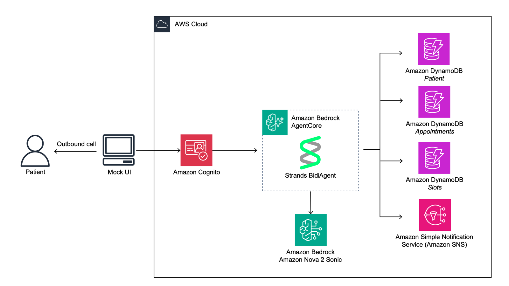
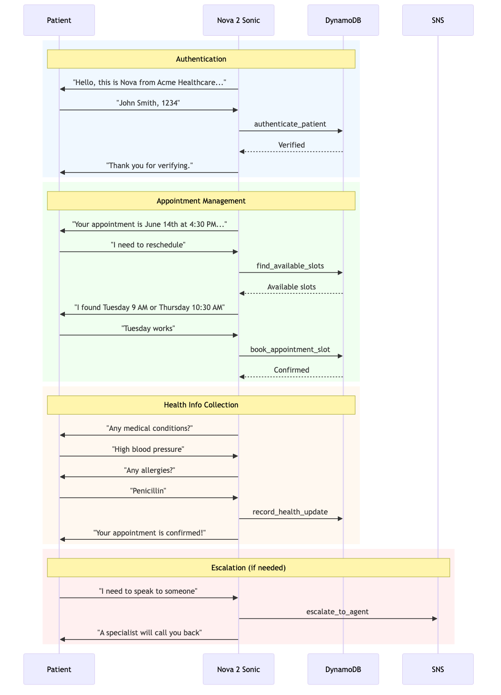

# Nova Sonic Healthcare Call Center

An AI-powered outbound call system for healthcare appointment management. Uses Amazon Nova 2 Sonic speech-to-speech model with AWS Bedrock AgentCore for natural, conversational patient interactions.

## Features

- **Natural speech-to-speech interactions** using Amazon Nova 2 Sonic
- **Secure patient authentication** using patient name and last 4 digits of SSN
- **Appointment management** — confirm, cancel, or reschedule with context awareness
- **Health information gathering** for upcoming appointments
- **Escalation to a live agent** with SNS notification
- **Multilingual support** — seamlessly switches to patient's preferred language
- **Low-latency bidirectional communication** via WebSocket with SigV4 authentication

## Demo

Watch the system in action:

[English Demo](https://www.youtube.com/watch?v=KsTOk5iizoo)

<details>
<summary>Other Languages</summary>

**Spanish Demo:**
[Watch Spanish Demo 1](https://www.youtube.com/watch?v=71ML0ZP1h_0)

[Watch Spanish Demo 2](https://www.youtube.com/watch?v=3J8Co0yyEGY)

**Hindi Demo:**
[Watch Hindi Demo](https://www.youtube.com/watch?v=fz9Xp4bXiiw)

</details>

## Prerequisites

- **AWS Account** with appropriate permissions
- **Amazon Bedrock Model Access** — Nova 2 Sonic
- **AWS CLI** configured
- **AWS CDK** installed
- **Node.js** 20+ and npm for frontend
- **Python** 3.12+ for backend (3.13 recommended)

## Architecture



### AWS Services Used

- **Amazon Bedrock AgentCore** — Runtime for BidiAgent deployment
- **Amazon Cognito** — User authentication and Identity Pool for SigV4 credentials
- **Amazon DynamoDB** — Patient and appointment data storage
- **Amazon SNS** — Escalation notifications

## Patient Conversation Flow



## Tool Architecture

| Tool | Description | Technology |
|------|-------------|------------|
| **authenticate_patient** | Verify patient identity (name + SSN last 4) | DynamoDB query |
| **confirm_appointment** | Confirm existing appointment | DynamoDB update |
| **cancel_appointment** | Cancel appointment with reason | DynamoDB update |
| **find_available_slots** | Query available time slots | DynamoDB query |
| **book_appointment_slot** | Book a specific slot | DynamoDB update |
| **record_health_update** | Capture health information | DynamoDB update |
| **escalate_to_agent** | Flag for human callback | SNS notification |

## Project Structure

```
sample-Nova-Sonic-AgentCore-Healthcare-Call-Center/
├── backend/                    # BidiAgent application code
│   ├── agent.py               # Main BidiAgent entry point
│   ├── Dockerfile             # Container for AgentCore
│   ├── clients/               # AWS service clients
│   ├── tools/                 # Healthcare tools
│   ├── prompts/               # System prompts
│   └── requirements.txt       # Python dependencies
├── frontend/                   # React application
│   ├── src/
│   │   ├── components/        # UI components
│   │   └── lib/               # WebSocket, audio, auth
│   └── package.json
├── infrastructure/             # CDK infrastructure
│   ├── app.py                 # CDK entry point
│   ├── stacks/                # CDK stacks
│   └── cdk_constructs/        # Modular constructs
└── docs/                       # Documentation and diagrams
```

## Getting Started

See the [Deployment Guide](docs/DEPLOYMENT.md) for step-by-step setup instructions and [cleanup](docs/DEPLOYMENT.md#clean-up).

## Disclaimer

- This is a reference implementation for demonstration purposes only.
- Both the frontend and backend are sample implementations not intended for production use without modification.
- Before deploying to production, conduct a thorough security review and HIPAA compliance assessment tailored to your organization's requirements.

## License

This project is licensed under the MIT License. See the [LICENSE](LICENSE) file for details.
